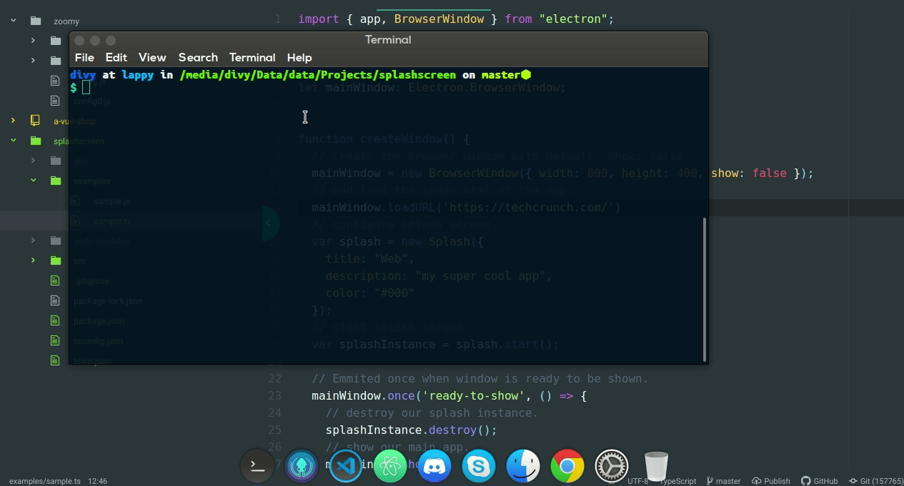

## electron-splashscreen



```sh
npm i @divy-work/electron-splashscreen
```

Elegant splashscreen for your cool electron apps.

### Usage

```js
var Splash = require('@divy-work/electron-splashscreen');

var splashscreen = new Splash({
  title: 'My app.',
  description: 'My super cool app.'
})

var splashscreenInstance = splashscreen.start();

setTimeout(splashscreenInstance.destroy, 5000)
```

### Example
Clone the repo, install the dependencies and then run
`npm run example` to launch the example.
